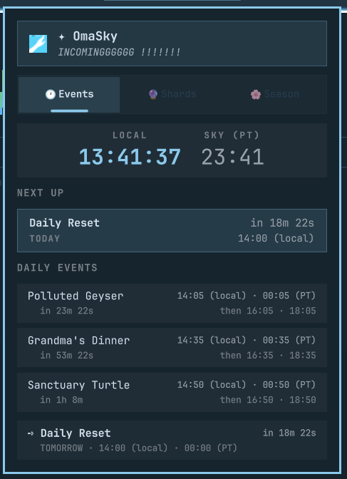
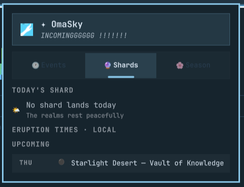
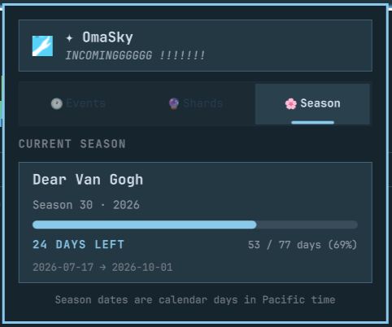

# qdot.omasky — OmaSky

Sky: Children of the Light for the Omarchy shell — the daily **event clock**,
**shard eruptions**, and **season tracker** in one widget. A single bar pill
(logo + one line) shows both the next world event with a live countdown and
today's shard; the popup panel has three tabs: **Events**, **Shards**, and
**Season**.

This plugin unifies event tracking, shard forecasts, and live season progress.

<p align="center">
  
  
  
</p>

## How it works

### Events tab
`sky_clock.py` computes everything locally — **no network**. Sky Mean Time is
Pacific time (`America/Los_Angeles`, DST-aware via `zoneinfo`). Every day the
world events run on 2-hour blocks starting at even hours:

| Event             | Start (minutes past even hour) | Duration |
|-------------------|--------------------------------|----------|
| Polluted Geyser   | 0:05                           | 10 min   |
| Grandma's Dinner  | 0:35                           | 10 min   |
| Sanctuary Turtle  | 0:50                           | 10 min   |
| Daily Reset       | 00:00 Pacific                  | —        |

The widget runs `python3 sky_clock.py --json 3` via a `Process` every
`refreshSeconds` (default 60) and on panel open. A 1-second timer drives all
countdown labels from the absolute `epoch_ms` values, so they tick live
between fetches. The Events tab shows the LOCAL (primary, live) and SKY (PT)
clocks, a NEXT UP hero with a big countdown, every daily event with next local
& Sky times plus following occurrences, and the Daily Reset row.

### Shards tab
`scripts/fetch_shard_details.py` fetches day-specific overrides from
`https://sky-shardfig.plutoy.top/all.json` (derived from
[PlutoyDev/sky-shards](https://github.com/PlutoyDev/sky-shards)); the schedule
math (realm rotation, map groups, eruption offsets, DST) is bundled, so only
the override fetch touches the network. The Shards tab shows today's shard
(dot, realm, map, AC reward, variants), the eruption windows
(`start → land → end`, rendered in the configured display timezone), and the
next shard days.

The network is hit at most **once per game day**: the script's output is
cached to `~/.local/state/omarchy/qdot.omasky/shards.json`, keyed to midnight
**America/Los_Angeles** (when the game day actually resets), and the widget
loads the cache first and skips the network when it's for the current game
day. Middle-click and the IPC `refresh` force a live fetch; a failed fetch
falls back to the last-known-good cached data.

### Season tab
`scripts/fetch_seasons.py` downloads season catalog data from the published
`skygame-data` package (`assets/seasons.json` mirror on CDN) and resolves the
season active on the current Pacific calendar day along with any upcoming
season.

All date calculations (days elapsed, days remaining, total days, progress ratio)
operate directly on Pacific calendar dates (`date` objects), avoiding DST drift.
The Season tab renders:
- An active season hero card with ordinal (`Season 30`), year, and name.
- A visual progress bar with percentage and `{elapsed} / {total} days` counter.
- A prominent `{remaining} DAYS LEFT` countdown badge (or `LAST DAY`).
- Calendar start and end date range.
- An upcoming season preview card (with countdown in days) when scheduled.

The season payload is cached separately to
`~/.local/state/omarchy/qdot.omasky/seasons.json` per LA game day, refreshed
every `seasonRefreshSeconds` (default 6 hours), and falls back gracefully to
cached data when offline.

### Bar widget
A logo + one line combining both event and shard sources. Default format is `both`:

```
🔴 Butterfly Fields · Geyser in 1h 03m
```

- The active event renders in the accent color with "… left".
- No shard today → the event line alone; right-click cycles
  `both → events → shard` (the format setting persists and the widget
  hot-reloads on save).
- Left-click opens the panel; right-click cycles the format; middle-click
  force-refreshes all sources (events, shards, season).

### Panel
Three tabs (click, Tab/Backtab, `1`/`2`/`3`, or ←/→). Esc closes, Enter/Space
refreshes, ↑/↓ scroll the active tab. The popup auto-sizes to whichever tab
is active. A rotating subtitle under the title refreshes on open and when the
day changes.

If the standalone `qdot.omaevents` or `qdot.omashard` plugin is not installed
on the machine, the corresponding tab shows a friendly notice with an install
button that opens the plugin's GitHub page in the browser. The Season tab is
built-in and native to OmaSky.

## Install

```bash
omarchy plugin add https://github.com/datbuiquoc035/OmaSky.git --enable
```

## Update

```bash
omarchy plugin update qdot.omasky
```

## Remove

```bash
omarchy plugin remove qdot.omasky
```

On first load OmaSky auto-replaces any `qdot.omashard` / `qdot.omaevents` bar
entries in `~/.config/omarchy/shell.json` with a single `qdot.omasky` entry
(backing the file up as `shell.json.bak.<timestamp>`; `format` is not carried
over since each plugin has its own vocabulary).

If the widget does not appear, force a rescan:
`omarchy-shell shell rescanPlugins`.

## Settings (inline shell.json entry)

| Key                    | Type    | Default   | Meaning                                         |
|------------------------|---------|-----------|-------------------------------------------------|
| `format`               | string  | `"both"`  | Bar label: `both` / `events` / `shard`          |
| `shardFormat`          | string  | `"map"`   | Shard piece in `shard`/`both`: `map` / `realm` / `full` |
| `refreshSeconds`       | number  | `60`      | Seconds between sky_clock.py runs (min 15)      |
| `showDailyReset`       | boolean | `true`    | Show the daily reset in the Events tab          |
| `shardRefreshSeconds`  | number  | `1800`    | Seconds between shard fetches (min 60)          |
| `seasonRefreshSeconds` | number  | `21600`   | Seconds between season fetches (min 3600)       |
| `upcomingDays`         | number  | `3`       | Shard preview days (1–7)                        |
| `timeZone`             | string  | `""`      | Shard display tz: `UTC+n`/`-n`, tz name, or empty for system local |

Example:

```jsonc
"layout": {
  "left": [
    // ...
    { "id": "qdot.omasky", "format": "both", "timeZone": "UTC+9" }
  ]
}
```

## Tests

```bash
python3 tests/test_sky_clock.py
python3 tests/test_fetch_shard_details.py
python3 tests/test_fetch_seasons.py
node tests/test_models.js
```

## License

MIT — see [LICENSE](LICENSE).
